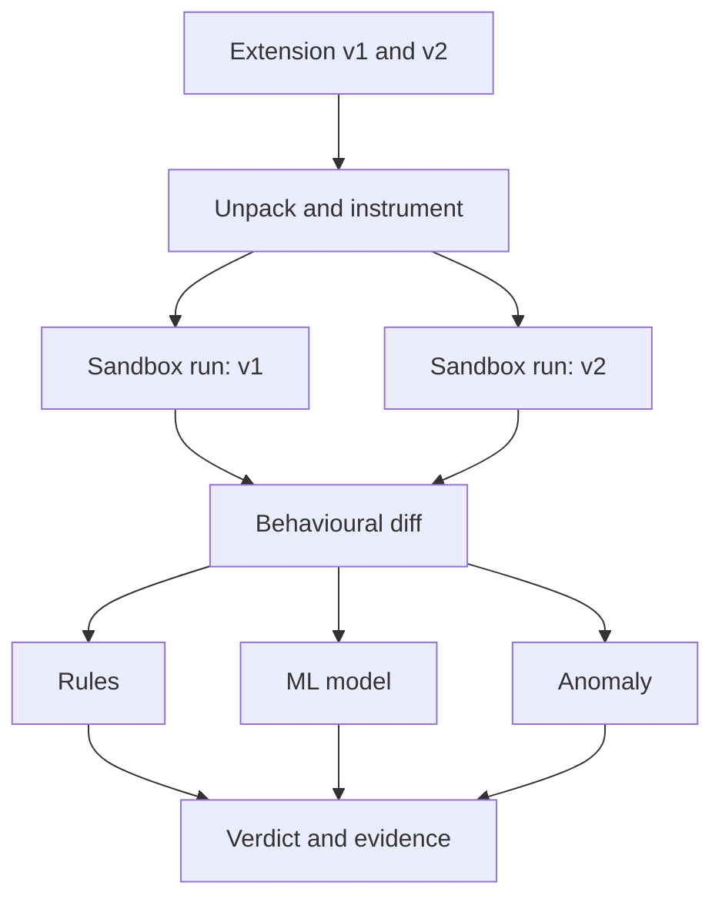
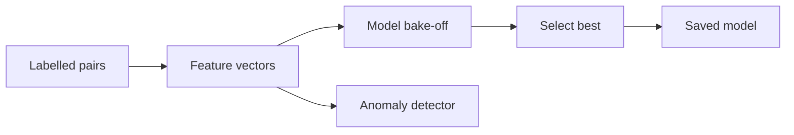

# extdrift

**Catch a browser extension the moment an update turns it malicious — by diffing what it *does*, not what its code says.**


A browser extension you trust can become spyware **overnight** through a single silent
auto-update — the browser grants its trust *once*, at install, and never re-checks it. The
**December 2024 Cyberhaven attack** did exactly this: a phished developer account pushed a
cookie-stealing update to ~2.6M users across dozens of extensions. Store review, permission
prompts, and code signing had all already passed the *benign* version.

**extdrift scores the *change*.** Give it two consecutive versions of the same extension; it
runs each in a sealed, deterministic sandbox, records what each actually does, diffs the
behaviour, and returns an **explainable verdict** — with transparent rules, a machine-learning
model, and an anomaly detector for the unseen.

---

## How it works



Each version runs in a headless sandbox — same scripted user actions, **byte-identical
pages**, network egress blocked — so the extension version is the *only* variable, and the
difference is the extension, not the noise of the live web. There are **two capture engines
behind one trace schema**: a Chromium engine (Playwright + `--host-resolver-rules`) and a
**Firefox engine** (Selenium temporary add-on + a local capture proxy) that turns the real
Firefox update pairs from the AMO collector into behavioural rows in the *same* format — so
real captured data trains the *same* model as the synthetic data, not a separate one. Four
channels are recorded — **network, DOM, storage/cookies, and `chrome.*`/`browser.*` API
calls** — reaching content scripts, the MV3 service worker and the MV2 background page (all
common exfiltration blind spots). The **behavioural delta**
`Δ = f(v2) − f(v1)` (26 features, incl. cross-component message-passing and destination-domain
reputation) is then scored three ways: transparent **rules**, an **ML
model**, and an **anomaly** detector, producing a `BENIGN / SUSPICIOUS / MALICIOUS` verdict with
the exact new behaviours that fired.

---

## Results that matter

Obfuscation hides the *code*, but the *runtime effect* is still visible — which is why a
dynamic diff beats static analysis on the case that matters most:

| On a payload that steals cookies | Static code-diff (prior work) | **extdrift (dynamic)** |
|---|---|---|
| Clean code | MALICIOUS ✓ | MALICIOUS ✓ |
| **Obfuscated code** | **BENIGN ✗ (missed)** | **MALICIOUS ✓ (0.99, leak confirmed)** |

And the machine-learning tier earns its place on the metric that decides whether a detector is
usable — the false-positive rate. On a hard **~1,000-pair** dataset (built with deliberate
overlap), under cross-validation that splits by extension:

| To catch 90% of malicious updates… | False positives |
|---|---|
| Transparent rules alone | flags **52%** of benign updates |
| **Learned model (XGBoost, the tabular SOTA)** | flags **~7%** |

*Anomaly layer:* trained only on benign updates, it flags malicious families it **never saw in
training** at **43–100%** (100% on credential/cookie theft, lower on stealthy families). *Figures
are from a synthetic corpus; real-world validation is the next milestone — see below.*

---

## Quickstart

```bash
pip install -r requirements.txt && playwright install chromium

# No browser — score three example update pairs instantly:
python scripts/demo_offline.py

# The real thing — load an extension in Chromium; a synthetic payload actually steals
# cookies, and we catch it:
python scripts/demo.py
```

```text
VERDICT   : MALICIOUS
Rules     : 0.99  [################################]   (6/12 fired)
ML model  : 0.88  [############################----]   (ml-xgboost, MALICIOUS; rules agree)
[ground truth] collector received data: True     ← the leak really happened
```

---

## The machine-learning approach

The model is chosen by **evidence, not convention**: five candidates — the interpretable rules,
Logistic Regression, Random Forest, XGBoost, and an SVM — race on the same behavioural-delta
features, judged by PR-AUC and false-positive rate under **cross-validation that splits by
extension and by time** (so it can't memorise an extension).



Selection is by PR-AUC and false-positive rate; the winner ships with SHAP-style feature
attribution. A separate **anomaly detector**, trained only on benign updates, flags behaviour no
model was trained on. The system predicts exactly one thing —
`P(this update introduced malicious behavioural change)` — and never claims more (no zero-day
*vulnerability* discovery). The rules stay as the interpretable control, and the learned model is
reported only when it beats them.

---

## Repository layout

```
engine/
  unpack/       .crx/.xpi unpacking + static manifest diff
  sandbox/      two capture engines (Chromium/Playwright + Firefox/Selenium) + proxy + test-site
  features/     trace schema, dynamic + static-code feature extraction, Δ = f(v2) − f(v1)
  scoring/      12 explainable heuristic rules
  synth/        synthetic update-pair corpus generator
  weaponiser/   real JS payloads (clean + obfuscated) → labelled malicious versions
  baseline/     static code-delta scorer (the prior-work baseline we beat)
  ml/           model bake-off, anomaly layer, live prediction
  collector/    real version-pair collection (AMO API, disk snapshot, extensiondeltas corpus)
  report/       explainable text + JSON verdicts
experiments/    ablations · learning curve · real static + behavioural capture (AMO/weaponised)
data/
  dataset/      the generated ~1,000-pair delta table (deltas.csv)
  real/         7,382 known-malicious extension IDs (public IOC DB, CC BY 4.0)
tests/          93 tests (incl. live browser integration)
```

> **Data.** The synthetic corpus is generated (`python -m engine.batch`) and committed as
> `data/dataset/deltas.csv`. Real known-malicious extension IDs come from the
> [chrome-mal-ids](https://github.com/mallorybowes/chrome-mal-ids) IOC database. Downloaded
> third-party extension code is **not** redistributed here.

## Tech stack

**Python** · **Playwright** (Chromium) + **Selenium** (Firefox) for the two capture engines ·
**scikit-learn** + **XGBoost** (the model tier) · **pandas / NumPy** · standard-library sandbox
test-site + capture proxy. The analysis + ML half is dependency-light and runs on a laptop;
only live browser capture needs a browser.

## Scope & honesty

- **This project:** dynamic, behavioural, cross-version diffing with record/replay determinism
  and explainable output — the open gap next to static update-diffing (*You've Changed*, CCS
  2020) and single-version dynamic analysis (*Hulk*; *ExtPrivA*, IEEE S&P 2023).
- **Deliberately out of scope:** consumer-side prevention before an update runs, discovery of
  unknown code vulnerabilities, and language-specific analysis — positioned instead for
  store / enterprise / researcher use.
- **Safety:** only synthetic, self-contained samples run, inside a network-restricted sandbox
  against fake pages with dummy credentials. Nothing is redistributed or hosted.

---

<sub>**CSD493 Project-1** · B.Tech CSE · Shiv Nadar Institution of Eminence · Bind Pratap Singh
& Suhani Deepak Agrawat · Advisor: Dr. Sweta Mishra. Academic research prototype for defensive
security research.</sub>
