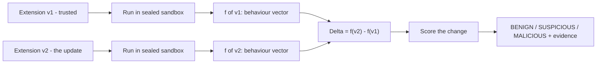
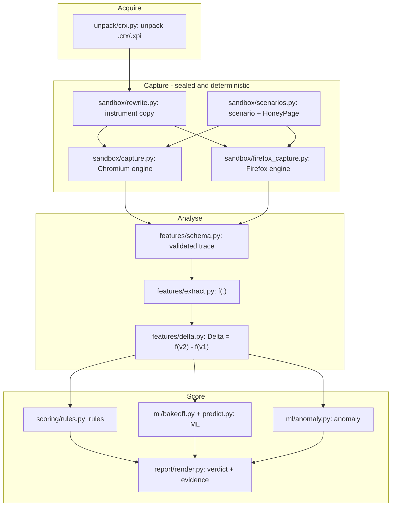
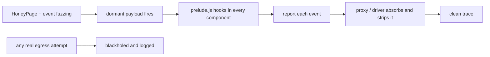
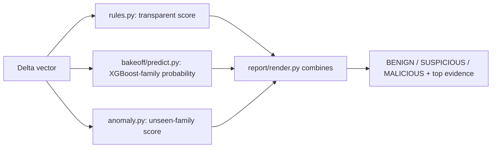
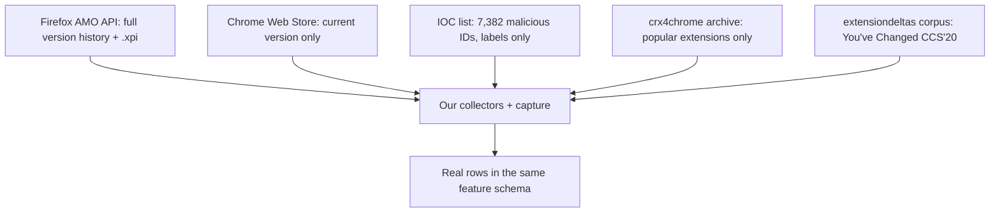

# extdrift — Detecting Malicious Browser-Extension Updates by Behavioural Diffing
### A complete technical knowledge document

**Purpose of this document.** Read it top to bottom and you will understand the entire project
with no prior background: what problem it solves, why that problem matters and is hard, how every
part is built (down to the exact source file), where the data comes from, how the models are
chosen and evaluated, and exactly what the finished system does. It is written to be enough, on
its own, to explain and defend the project — including a dedicated *anticipated panel questions*
section (§18).

> **One-sentence summary.** A browser extension you already trust can turn malicious in a *silent
> automatic update*; extdrift takes two consecutive versions of the same extension, runs each in a
> sealed deterministic sandbox, records exactly what each one *does*, and flags the update when the
> **change in behaviour** looks like data theft, ad injection, or exfiltration — it scores the
> *change*, not the extension.

| | |
|---|---|
| **Course** | CSD493 Project-1, B.Tech CSE, Shiv Nadar Institution of Eminence |
| **Team** | Bind Pratap Singh (2310110084) · Suhani Deepak Agrawat (2310110717) |
| **Advisor** | Dr. Sweta Mishra |
| **Repository** | github.com/bindpratapsingh/extdrift |
| **Scale** | ~4,600 lines of Python across 41 modules · 111 automated tests · 39 commits |

---

## Table of contents
1. [The problem, and why it matters](#1-the-problem-and-why-it-matters)
2. [The core idea](#2-the-core-idea)
3. [Why this is genuinely hard — the six pitfalls](#3-why-this-is-genuinely-hard--the-six-pitfalls)
4. [Codebase map — every file and what it builds](#4-codebase-map--every-file-and-what-it-builds)
5. [Architecture walkthrough](#5-architecture-walkthrough)
6. [The sandbox: determinism, safety, instrumentation, elicitation](#6-the-sandbox-determinism-safety-instrumentation-elicitation)
7. [The trace schema](#7-the-trace-schema)
8. [The features: what we measure and why](#8-the-features-what-we-measure-and-why)
9. [Scoring layer 1 — the transparent rules](#9-scoring-layer-1--the-transparent-rules)
10. [Scoring layer 2 — the ML bake-off (why XGBoost)](#10-scoring-layer-2--the-ml-bake-off-why-xgboost)
11. [Scoring layer 3 — the anomaly detector](#11-scoring-layer-3--the-anomaly-detector)
12. [Real data: sources, collectors, and why malicious pairs don't exist](#12-real-data-sources-collectors-and-why-malicious-pairs-dont-exist)
13. [Synthetic data: generator and weaponiser](#13-synthetic-data-generator-and-weaponiser)
14. [Dataset size — real vs synthetic](#14-dataset-size--real-vs-synthetic)
15. [The experiments (what each one proves)](#15-the-experiments-what-each-one-proves)
16. [Results](#16-results)
17. [Limitations and honesty](#17-limitations-and-honesty)
18. [Anticipated panel questions and answers](#18-anticipated-panel-questions-and-answers)
19. [How to run everything](#19-how-to-run-everything)
20. [References](#20-references)

---

## 1. The problem, and why it matters

Browser extensions are among the most privileged software a normal person installs. Once granted,
an extension can read the content of every web page you open, your cookies (which *are* your logged-
in sessions), the text you type into forms, your browsing history, and it can rewrite pages before
you see them. Hundreds of millions of people install extensions from the Chrome Web Store and
Firefox Add-ons (AMO) — and then forget them, because **extensions update themselves automatically
and silently.** You vet an extension once, at install; after that, new code lands on your machine
without you ever seeing it or approving it.

That auto-update channel is the attack surface. An extension can be **honest for years and then turn
malicious in a single update** — because the developer sold it to a new owner, or their store
account was phished, or a dependency was compromised.

This is not hypothetical:

- **Cyberhaven, December 2024** — a phished developer account pushed a malicious update to a
  legitimate, widely-installed enterprise extension; the update exfiltrated cookies and session
  tokens from everyone whose browser auto-updated. This is the canonical motivating incident.
- **DataSpii (2019)** — several extensions quietly collected and sold browsing data from millions.
- **Palant / PDF Toolbox & SeaSearch (2023)** — ad-injection and tracking bolted onto extensions
  reaching ~87 million users.
- **Nano Adblocker (2020)** — turned malicious shortly after being sold to a new owner.

Most of these are **adware** in the broad sense: ad injection, affiliate-link hijacking, and
data collection stapled onto a formerly-clean extension. Our working position (documented in
`docs/design/DESIGN_RATIONALE.md`) is that adware of this kind **is in scope as malicious**,
because it exfiltrates data and tampers with pages without consent.

**Why the stores don't already catch this.** Store review largely evaluates an extension in
isolation and at a point in time. It is not designed to reason about *what changed between two
consecutive versions and whether that change is dangerous.* That specific gap — the malicious
*update*, not the malicious *extension* — is what extdrift targets.

---

## 2. The core idea

The insight is one sentence: **don't score the extension, score the change.**

A password manager reads your password in *every* version — that alone is never suspicious. What is
suspicious is an *update* that *newly starts* sending that password to a server the extension never
contacted before. So for two consecutive versions v1 (trusted baseline) and v2 (candidate update),
we compute a behaviour feature vector `f(.)` for each and take the **behavioural delta**:

```
Δ  =  f(v2)  −  f(v1)
```

The label lives in Δ. We then score Δ three independent ways and emit a verdict with evidence.



**What is novel.** The closest prior work, *You've Changed* (CCS 2020), also diffs consecutive
versions but does it **statically** — comparing source code. Static diffing is blinded by
obfuscation: an attacker minifies or encodes the payload and the code diff can no longer read the
intent. Our wedge is the **dynamic behavioural diff**: obfuscation hides the *code*, but the
*effect* — a cookie read closely followed by an upload to a brand-new host — is still observable
when the code actually runs. We implement the static method too (`engine/features/static_code.py`,
`engine/baseline/static_delta.py`) precisely so we can demonstrate this head-to-head (§15).

---

## 3. Why this is genuinely hard — the six pitfalls

If it were easy, the stores would already do it. Strong security papers succeed by explicitly
avoiding a set of traps that make weaker work either impossible or misleadingly good. We designed
against all six.

1. **Web noise makes a naive diff meaningless.** Browse the live web twice and the ads, nonces,
   timestamps, and A/B buckets differ on their own; a diff of two live runs fills with noise that
   has nothing to do with the extension. → We built a *deterministic* sandbox where both versions
   see byte-identical pages (§6).
2. **Isolating the update delta.** The signal is the *difference* between versions under an
   *identical* run; if the two runs differ for any reason other than the extension, the delta is
   junk. → Identical scripted scenario + identical replayed web for both versions.
3. **Dilatory (trigger-based) evasion.** Malicious behaviour fires only on specific triggers (a
   login form appearing, a timer). *Hulk* (USENIX 2014) showed idle pages reveal nothing. → A
   HoneyPage that presents whatever a payload looks for, plus event-handler fuzzing (§6).
4. **Multi-component architecture and the MV3 blind spot.** Extensions split logic across content
   scripts, a background service worker, and popups, and pass messages between them; the
   Manifest-V3 service worker has *no page* to hook. An analyzer watching one component misses
   cross-component exfiltration. → We instrument every component and record message passing (§6, §8).
5. **Temporal data leakage.** If you train on later updates and test on earlier ones, you "train on
   the future" and your numbers lie. → We report a strict temporal split (§10).
6. **Grouping leakage and missing ablations.** If the same extension appears in both train and test,
   the model memorises it. And a multi-part feature set must prove each part earns its place. → We
   split by extension (StratifiedGroupKFold) and run feature/other ablations (§10, §15).

A seventh, project-specific hard part: **no public labelled dataset of malicious update *pairs*
exists** (we prove this empirically in §12), which forces the synthetic + weaponise strategy (§13).

---

## 4. Codebase map — every file and what it builds

The system is organised as a Python package `engine/` (the product), `experiments/` (studies that
produce evidence), `tests/` (111 automated tests), and `scripts/` (demos). Every file below is real
and cited again in the relevant section.

### `engine/unpack/` — turn a package into an analysable directory
| File | LOC | What it builds |
|---|---:|---|
| `crx.py` | 225 | Safe unpacker for `.crx` (Chrome), `.xpi` (Firefox), `.zip`, or a directory; parses the CRX2/CRX3 header, derives the extension ID, and refuses path-traversal / zip-slip / symlink entries. |
| `manifest.py` | 120 | Manifest normalisation (MV2 vs MV3) and the **static permission diff** (which high-risk permissions and host permissions an update added). |

### `engine/sandbox/` — capture what an extension does, deterministically and safely
| File | LOC | What it builds |
|---|---:|---|
| `testsite.py` | 205 | An in-process web server that serves **byte-identical** pages for fake `.test` hosts (a fake bank, webmail, and a HoneyPage) plus a fake "collector" that logs exfiltration attempts. |
| `proxy.py` | 164 | A local **forward proxy** for the Firefox engine: serves the same test site, absorbs the instrumentation's reports, logs the collector, and **blackholes all other egress** (sealed by construction). |
| `rewrite.py` | 140 | Makes an **instrumented copy** of an extension: prepends the JS *prelude* to every script the manifest loads (content scripts, MV2 background pages, MV3 service workers). |
| `prelude.js` | — | The injected instrumentation itself: hooks `document.cookie`, `fetch`/`XHR`/`sendBeacon`, and `chrome.*`/`browser.*`, and reports each event over the network channel. |
| `scenarios.py` | 158 | The scripted "emulate a user" scenarios (goto/fill/click/wait/scroll/**fire_events**), including the Hulk-style **HoneyPage** scenario and the event-fuzzing script. |
| `capture.py` | 269 | The **Chromium engine** (Playwright): loads the instrumented extension with `--host-resolver-rules`, runs the scenario, and writes a schema-valid trace. |
| `firefox_capture.py` | 217 | The **Firefox engine** (Selenium): loads the instrumented extension as a temporary add-on, routes it through the capture proxy, runs the scenario, and writes the *same* trace schema. |

### `engine/features/` — turn a trace into numbers
| File | LOC | What it builds |
|---|---:|---|
| `schema.py` | 108 | The **trace schema** — the contract between the sandbox and everything downstream; validates every trace. |
| `extract.py` | 339 | `f(.)`: reduces one trace to the **26 behavioural features**; the `FEATURE_DOCS` table is the single source of truth mapping each feature to its meaning and the paper that motivates it. |
| `delta.py` | 110 | Computes `Δ = f(v2) − f(v1)` (the numeric delta) **and** the human-readable evidence (new hosts, new APIs, new permissions). |
| `static_code.py` | 119 | The browser-free **static-code** feature set (27 features) from source + manifest; the *You've Changed* method, incl. the discriminative-API tokens we adopted from that corpus. |
| `ast_diff.py` | 111 | A structural token-diff **baseline** (churn magnitude only), to prove the semantic static features earn their place. |

### `engine/scoring/`, `engine/ml/`, `engine/report/` — score and explain
| File | LOC | What it builds |
|---|---:|---|
| `scoring/rules.py` | 279 | **Tier 1**: 12 transparent weighted rules (R01–R12) → a score and verdict; the interpretable control the ML must beat. |
| `ml/bakeoff.py` | 312 | **Tier 2**: the six-model bake-off with leakage-free grouped + temporal evaluation; selects and saves the winner. |
| `ml/anomaly.py` | 102 | **Tier 3**: IsolationForest / OneClassSVM trained only on benign deltas → flags *unseen* malicious families (zero-day). |
| `ml/predict.py` | 55 | Applies the trained winner to a single update at analysis time. |
| `report/render.py` | 154 | Renders one human-readable report and one machine-readable JSON record with the exact new behaviours that fired. |

### `engine/synth/`, `engine/weaponiser/`, `engine/batch.py` — make the dataset
| File | LOC | What it builds |
|---|---:|---|
| `synth/generate.py` | 347 | The synthetic corpus generator: 12 personas × 9 payload families with deliberate hard-benign / stealth-malicious overlap. |
| `weaponiser/payloads.py` | 152 | The library of **real** JavaScript payloads (cookie/credential/beacon…) + the obfuscator. |
| `weaponiser/weaponise.py` | 148 | Injects a payload into a real benign extension's own code → a labelled malicious v2 (clean or obfuscated). |
| `batch.py` | 138 | Assembles the ML-ready table (`data/dataset/deltas.csv`): one row per update pair, folding synthetic + live-captured rows into one schema. |

### `engine/collector/` — get real data
| File | LOC | What it builds |
|---|---:|---|
| `amo.py` | 166 | Firefox AMO v5 API collector: full version history + `.xpi` per version; popularity crawl (`amo_top_slugs`, `collect_top`). |
| `chrome.py` | 179 | Chrome Web Store update-endpoint collector (current CRX + delisting probe) + best-effort crx4chrome historical resolver. |
| `extensiondeltas.py` | 265 | Adapter for the *You've Changed* (CCS'20) corpus: download, discriminative-API list, label loader. |
| `download.py` | 75 | Download versions from GitHub tags / the Google update endpoint. |
| `snapshot.py` | 70 | Snapshot currently-installed Chrome extensions off disk (for longitudinal collection). |
| `corpus.py` | 41 | The corpus manifest (one JSONL row per collected pair). |

### `engine/runner.py` and `engine/cli.py`
`runner.py` (72 LOC) is the end-to-end orchestration (two dirs in → one scored report out);
`cli.py` (272 LOC) is the command-line entry point (`run-pair`, `diff`, `rules`, `manifest-diff`,
`unpack`).

### `experiments/` — the evidence
`headtohead.py`, `ablation.py`, `feature_ablation.py`, `learning_curve.py`, `ast_diff_baseline.py`,
`real_static_dataset.py`, `firefox_spike.py`, `capture_amo_behavioural.py`,
`capture_weaponised_behavioural.py`, `real_behavioural_eval.py`, `chrome_delisting_probe.py` — each
explained in §15.

---

## 5. Architecture walkthrough



The whole thing is driven end-to-end by `engine/runner.py::run_pair(v1_dir, v2_dir, scenario)`,
which captures both versions, diffs, scores, and writes `report.json` + `report.txt`. The analysis
half (unpack → features → scoring) is pure standard-library Python and runs on any laptop; only the
capture half needs a browser.

---

## 6. The sandbox: determinism, safety, instrumentation, elicitation

This is where most of the engineering rigor lives, because it is what makes a diff *mean* something.

**Determinism — both versions see one fixed web.** (`engine/sandbox/testsite.py`,
`engine/sandbox/proxy.py`)
- The test site serves byte-identical HTML for fake hosts under the reserved `.test` TLD (RFC 6761):
  `demo-bank.test`, `webmail.test`, and `honeypage.test`. Same bytes every request, no caching.
- The **Chromium engine** maps every `.test` name to that server with Chromium's
  `--host-resolver-rules`, so no DNS query and no packet leaves the machine.
- The **Firefox engine** has no such flag, so it is pointed at a local **forward proxy**
  (`proxy.py`) that serves the same pages and blackholes everything else.

**Safety — nothing ever leaves the machine.** All egress is intercepted. When a (synthetic) payload
exfiltrates, it hits a fake collector host that logs the attempt as ground-truth proof of a leak,
but no data reaches the real internet. Real extensions are analysed locally; their downloaded code
is never redistributed (the download areas are gitignored).

**Instrumentation — seeing inside every component.** (`engine/sandbox/rewrite.py`,
`engine/sandbox/prelude.js`) We never analyse the original files; we make a scratch copy and prepend
a small JS *prelude* to every script the manifest loads — content scripts, MV2 `background.scripts`
**and** `background.page`, and MV3 `service_worker`. The prelude hooks the security-relevant APIs and
reports each event by POSTing to a sealed reporting host, which the driver reads off and strips from
the trace so the instrumentation itself never appears as extension behaviour. Both versions get
byte-identical instrumentation, so the diff stays sound, and the record of exactly what was changed
travels in the trace (`run.instrumentation`).

**Elicitation — the HoneyPage (Hulk technique).** (`engine/sandbox/scenarios.py`) An idle page
reveals nothing, so a scripted scenario drives a page dense with everything a data-stealing payload
looks for (login form, credential and card fields, a session cookie), fills the fields, then a
`fire_events` step **fuzzes event handlers** (dispatches synthetic `submit`/`input`/`click` events)
so dormant handlers fire without a real navigation that would race the trace, and dwells long enough
for delayed beacons.



> **A real bug we found and fixed here, worth stating because a panel may probe capture fidelity.**
> In a Firefox content script, `window` is the *page's* Xray-wrapped object whose `fetch`/`XHR`
> differ from the ones the content script actually calls; our prelude was hooking the wrong realm,
> so content-script events were silently lost and our own reports were CORS-blocked. Switching to
> `globalThis` (the current realm's global) and reporting to a `.test` host via a plain `fetch` fixed
> it — and immediately took real-extension malicious recall from 70% to 100%.

---

## 7. The trace schema

Defined and enforced in `engine/features/schema.py`. Every capture — Chromium, Firefox, or
synthetic — produces the same JSON structure, which is the contract the rest of the system reads:

- `schema_version` — so incompatible traces are rejected loudly.
- `extension` — `{id, name, version}`.
- `run` — `{browser, scenario, pages, replay_bundle, instrumentation, duration_s, collector_received}`.
- `manifest` — the extension's parsed manifest.
- Four **event-channel arrays**, one per observation channel:
  - `network` — `{ts, url, method, initiator, resource_type, body_len}` per request.
  - `dom` — `{ts, event, target, value_len, origin}` (reads, injections).
  - `storage` — `{ts, api, count}` (cookie / storage calls).
  - `api` — `{ts, api, frame}` (`chrome.*`/`browser.*` calls, with which component made them).

Because synthetic traces and real captured traces share this schema exactly, a model trained on one
can be evaluated on the other — which is what makes the synthetic→real transfer test (§16) possible.

---

## 8. The features: what we measure and why

Two complementary feature sets. Every feature is (a) cheap, (b) explainable in one sentence, and
(c) traceable to a paper — the mapping lives in `FEATURE_DOCS` inside `engine/features/extract.py`.

**A. Behavioural features — 26, from what the extension does at runtime** (`extract.py`), grouped by
the four channels, plus 3 static manifest-diff features (`engine/batch.py`) for **29 columns** total:

| Group | Features | Signal | Provenance |
|---|---|---|---|
| Network | net_requests, net_hosts, net_third_party_hosts, net_ext_initiated, net_posts, net_upload_bytes, net_max_upload_bytes, net_encoded_params, net_worker_initiated, **net_lowrep_hosts** | Exfiltration = new outbound uploads to new/low-reputation hosts | ExtPrivA S&P'23; Hulk'14; Antonakakis'12 |
| DOM | dom_reads, dom_sensitive_reads, dom_identity_reads, dom_injections | Credential/keystroke theft and ad injection touch the DOM | VEX NDSS'10; ExtPrivA |
| Storage | storage_calls, cookie_reads, cookie_bulk_reads | Session-token theft reads the whole cookie jar | Cyberhaven Dec'24 |
| API | api_calls, api_distinct, api_high_risk, **msg_passing** | The privileged capability set; message passing is the multi-component tell | Hulk; EmPoWeb S&P'19 |
| Static (manifest) | perm_count, perm_high_risk, host_perm_breadth | Permission escalation across the update | VEX |
| Derived | exfil_flows, exfil_flows_third_party | A lightweight taint proxy: a secret read closely followed by an upload | ExtPrivA |

The `msg_passing` (cross-component IPC) and `net_lowrep_hosts` (DGA/NRD-like destination) features
were added specifically to close pitfalls #4 and to strengthen the network channel.

**B. Static-code features — 27, from what the source contains** (`engine/features/static_code.py`).
This is the browser-free *You've Changed* method and how we bring **real** code into the pipeline
without a browser. It counts security-relevant tokens (API/sink/obfuscation) and permission shifts
between two versions. We **adopted the empirically most-discriminative token set from the *You've
Changed* corpus itself** (`engine/collector/extensiondeltas.py::discriminative_apis`, their 66-token
`sixtyAPIs` list): ad injection (`googleTag.defineSlot`, `Analytics.trackEvent`), self-preservation
(`setUninstallURL`, `uninstallSelf`, `webstore.install`), dynamic script writing, and broad data
access (`bookmarks`/`downloads`/`management`). This is exactly "adopt the parameters strong security
papers use."

---

## 9. Scoring layer 1 — the transparent rules

`engine/scoring/rules.py` implements Tier 1: a **weighted-rule scorer**, deliberately transparent so
an analyst can read *why* an update was flagged, and used as the control the ML must beat. The 12
rules, each with a weight and a provenance:

| ID | Rule | Weight |
|---|---|---:|
| R01 | New exfiltration flow to a third party | 0.75 |
| R02 | New bulk cookie read | 0.55 |
| R03 | New credential-field access | 0.50 |
| R04 | New upload destination | 0.60 |
| R05 | Encoded payload in URL | 0.45 |
| R06 | High-risk permission escalation | 0.40 |
| R07 | Host permission broadened | 0.35 |
| R08 | New high-risk API usage | 0.35 |
| R09 | Service-worker-initiated beaconing | 0.40 |
| R10 | Outbound volume spike | 0.30 |
| R11 | New page-content injection | 0.25 |
| R12 | Contact surface widened | 0.20 |

The score is a saturating combination of fired rule weights; verdict thresholds are
`SUSPICIOUS ≥ 0.35` and `MALICIOUS ≥ 0.70` (constants `THRESHOLD_SUSPICIOUS`,
`THRESHOLD_MALICIOUS`). These are analyst review thresholds, not a court verdict, and the fired rules
+ their evidence are always reported.

---

## 10. Scoring layer 2 — the ML bake-off (why XGBoost)

`engine/ml/bakeoff.py` is the heart of "why XGBoost, and how we concluded that." **We do not just
pick XGBoost.** We run an evidence-based bake-off of six approaches on the *identical* features and
let the numbers decide:

1. **rules** — the transparent control (must be beaten).
2. **logreg** — Logistic Regression, the linear floor.
3. **rf** — Random Forest.
4. **xgboost** — gradient-boosted trees, the usual tabular state-of-the-art.
5. **histgb** — scikit-learn's HistGradientBoosting (a second boosting implementation, so the result
   does not hinge on one library).
6. **svm** — RBF Support Vector Machine.

**Leakage-free evaluation with both protocols top papers require:**
- **StratifiedGroupKFold by `ext_id`** — all versions of one extension stay in one fold (no grouping
  leakage).
- **A strict temporal split** — train on earlier updates, test on later ones (no "training on the
  future").
- **Metrics:** PR-AUC (right for imbalanced detection) and **false-positive rate at 90% recall** (the
  number that decides usability). Selection: highest PR-AUC, tie-broken by lower FPR. The winner, its
  metrics card, and its feature importances are saved under `engine/ml/models/`.

**Current bake-off (extension-level cross-validation, 1,047-row dataset):**

| Model | PR-AUC | ROC-AUC | Precision | Recall | F1 | FPR @ 90% recall |
|---|---:|---:|---:|---:|---:|---:|
| **HistGradientBoosting** | **0.983** | 0.982 | 0.967 | 0.913 | 0.939 | **0.008** |
| XGBoost | 0.982 | 0.983 | 0.943 | 0.920 | 0.931 | 0.015 |
| Random Forest | 0.982 | 0.983 | 0.964 | 0.900 | 0.931 | 0.027 |
| SVM | 0.972 | 0.977 | 0.975 | 0.880 | 0.925 | 0.028 |
| Logistic Regression | 0.972 | 0.975 | 0.928 | 0.895 | 0.912 | 0.062 |
| **Rules (control)** | 0.868 | 0.883 | 0.604 | 0.913 | 0.727 | **0.450** |

**How we concluded "the gradient-boosting family":** the two boosting implementations (HistGB, XGBoost)
and Random Forest occupy the top and are statistically indistinguishable (~0.982–0.983); they beat
every non-tree model and **crush the rules control** — to catch 90% of malicious updates the rules
flag **45%** of benign updates as false positives, while the boosted model flags **under 2%**. XGBoost
is the canonical, well-understood representative of this family and the field consensus for
heterogeneous, sparse, interpretable tabular data; HistGradientBoosting is its scikit-learn-native
equivalent and wins the tie-break here. So "XGBoost" is shorthand for *the gradient-boosted-tree
family selected by the bake-off*, not an arbitrary pick — and the bake-off is re-runnable, so the
choice is reproducible, not asserted.

The choice is robust: under the **temporal split** the winner holds (~0.97 PR-AUC on later updates);
**SMOTE vs `class_weight`** are equivalent (~0.98 either way — an honest reported ablation); and the
**feature ablation** shows every channel earns its place (DOM contributes most; network is most
predictive alone at 0.89; the channels are complementary).

---

## 11. Scoring layer 3 — the anomaly detector

`engine/ml/anomaly.py` trains IsolationForest / OneClassSVM **only on benign deltas** and flags
anything that looks unlike normal benign updates. Evaluated **leave-one-family-out** (train on all
but one malicious family, test on the held-out family), it catches families it **never saw in
training** at 43–100% (100% on credential/cookie theft, lower on stealthy families). This is the
zero-day / concept-drift case a supervised classifier structurally cannot cover, and it is why we
keep three layers rather than one.



---

## 12. Real data: sources, collectors, and why malicious pairs don't exist

This is the part a panel attacks hardest, so we are exact about what is obtainable and what is not.



**Sources and the collectors we wrote:**
- **Firefox AMO v5 API** (`engine/collector/amo.py`) — exposes the **full version history** with a
  direct `.xpi` per version; the gold standard for real, consecutive **benign** update pairs. We also
  crawl by popularity (`amo_top_slugs`, `collect_top`) — the You've Changed / ExtPrivA method.
- **Chrome Web Store update endpoint** (`engine/collector/chrome.py`) — serves the **current** CRX for
  any *listed* extension (we force a very high product version so it always offers the current one).
- **IOC list** (`data/real/mallorybowes/`, CC-BY-4.0) — 7,382 known-malicious Chrome IDs (labels only).
- **crx4chrome** (best-effort, fragile) — the only public archive of *historical* Chrome CRX files.
- **extensiondeltas corpus** (`engine/collector/extensiondeltas.py`) — the *You've Changed* research
  corpus (~90 MB); we fold in its discriminative-API list (§8B).

**Why real *malicious update pairs* cannot be sourced — proven, not assumed:**
1. Chrome serves **only the current version** — no history.
2. **~60% of known-malicious IDs are delisted** (Google removed them), so even the current version is
   gone — we measured this with `experiments/chrome_delisting_probe.py` (~40% still live, ~60% gone).
3. For the ~40% still live, their **earlier versions are not archived**: crx4chrome had history for
   **0 of 15** live-malicious IDs we checked (`--history` flag of the same probe).
4. So a `(benign v1 → malicious v2)` real pair **cannot be assembled from public sources**; even the
   academic corpus provides clusters/API-sequences, not downloadable labelled pairs.

**Our resolution — weaponise real extensions** (`engine/weaponiser/`). We take a **real** benign
extension and inject a **real** payload into its own code, producing a real-extension-turned-malicious
v2 with a *guaranteed* malicious delta, captured behaviourally under the same scenario. This is the
standard substitute when clean malicious pairs are unavailable, and we validate it by showing a
synthetic-only model still catches these real weaponised extensions (§16). **What we have today:** 15
real extensions captured as real benign updates **and** weaponised → 45 real behavioural pairs; plus
10 real extensions in the static-code track.

---

## 13. Synthetic data: generator and weaponiser

**Why synthetic at all.** Because real malicious pairs don't exist (§12) and we need thousands of
labelled examples. `engine/synth/generate.py` produces schema-valid trace *pairs* at scale without a
live browser per row, and it is deliberately built to be **hard** so the ML has something real to
learn:

- **12 benign personas** (reader, shopper, contacts, password-manager, weather, translator,
  ad-blocker, coupon, screenshot, notes, dictionary, video-helper) — a shared shape for v1 and v2.
- **9 malicious payload families** — cookie theft, credential theft, service-worker beacon, ad
  affiliate, keylogger, history exfiltration, form-jacking, redirect hijack, clipboard steal.
- **Deliberate overlap and noise** so no single threshold separates the classes: per-run *count
  jitter*; *hard-benign* updates that add a new third-party host / permission / analytics POST (they
  look like exfiltration); *stealth-malicious* updates that don't escalate a permission, exfiltrate
  only a small payload, or beacon to a CDN-looking host; and the invariant that **the label lives in
  the delta**, not the raw counts.

**The weaponiser** (`engine/weaponiser/payloads.py`, `weaponise.py`) injects *real* JavaScript
payloads (not descriptions) into an extension's own files, in **clean and obfuscated** variants with
*identical runtime behaviour* — this drives the "static analysis is blinded, dynamic still sees it"
head-to-head, and it is what turns a real benign extension into a real malicious sample (§12).

**Default parameters:** ~250 synthetic extensions × 4 updates; ~40% of updates malicious; of those
~35% stealth; ~50% obfuscated; ~1/3 of benign updates are "hard." All hosts use `.test`; all
credentials are fake fixtures.

---

## 14. Dataset size — real vs synthetic

Assembled by `engine/batch.py` into `data/dataset/deltas.csv`: **1,047 update pairs across 266
extensions, 449 malicious / 598 benign**.

| Source | Rows | Class | What it is |
|---|---:|---|---|
| Synthetic | 1,000 | mixed | Generated pairs (250 exts × 4 updates) |
| `amo-firefox-weaponised` | 30 | malicious | 15 real extensions weaponised (2 families each) |
| `amo-firefox` | 15 | benign | 15 real benign AMO updates, captured via the Firefox engine |
| live-capture (fixtures) | 2 | mixed | The reference toy extension |
| **Total** | **1,047** | 449 / 598 | one 29-feature schema |

A separate static-code track holds 40 rows across 10 real extensions on 27 source features. So the
bulk is synthetic (it must be — real malicious pairs don't exist), but real data is present *in the
same schema* and drives the honest validation in §16.

---

## 15. The experiments (what each one proves)

Each file in `experiments/` produces a specific piece of evidence:

- `headtohead.py` — static code-diff vs our dynamic diff on an obfuscated payload: static misses it
  (BENIGN), dynamic catches it (MALICIOUS, leak confirmed). Proves the core novelty.
- `ablation.py` — the determinism ablation: false positives with vs without record/replay. Proves the
  sandbox removes web-noise false positives.
- `feature_ablation.py` — leave-one-group-out + group-alone: proves every feature channel earns its
  place (DOM most important; network 0.89 alone).
- `learning_curve.py` — PR-AUC vs dataset size: synthetic plateaus ~0.97 by ~400–800 pairs → more
  synthetic has diminishing returns, real data is the next gain.
- `ast_diff_baseline.py` — semantic static features (0.99) vs raw token churn (0.81) vs combined
  (0.997) on real code: the richer features earn their place.
- `real_static_dataset.py` — the static-code track on real AMO code + weaponised: PR-AUC 1.0
  leave-one-extension-out.
- `firefox_spike.py` — the feasibility probe that validated the Firefox engine end-to-end.
- `capture_amo_behavioural.py` — captures real AMO benign updates into the behavioural dataset.
- `capture_weaponised_behavioural.py` — captures real-extension-turned-malicious (the real malicious
  class).
- `real_behavioural_eval.py` — the headline honest test: scores only the real pairs and runs the
  **synthetic→real transfer** evaluation.
- `chrome_delisting_probe.py` — the survivorship-bias finding (~40% live / ~60% delisted; 0/15 archived
  predecessors) that proves real malicious pairs can't be sourced.

---

## 16. Results

**On the hard synthetic corpus (leakage-free CV):** the learned model reaches ~0.98 PR-AUC at **<2%
false positives for 90% recall**, versus **45%** for the rules — the ML tier clearly earns its place.

**Real-world validation — does synthetic training transfer to real extensions?** The decisive test:
train on **synthetic data only** and evaluate on the **45 real captured pairs the model never saw**
(15 real extensions, benign updates + weaponised).

| Held-out test on real extensions (45 pairs) | Result |
|---|---|
| Rules — recall on real weaponised extensions | **30 / 30 = 100%** |
| **Model trained on synthetic only → tested on real** | **PR-AUC 0.998 · recall 0.93 · precision 1.0 · 0% false positives** |

A model that never saw a real extension separates real weaponised ones from real benign updates —
the empirical justification for the entire synthetic-data approach.

**A concrete case for ML over rules, on real data:** three real benign updates (LanguageTool, Privacy
Badger, Return-YouTube-Dislikes) legitimately changed their network behaviour and **tripped a rule**
(false positives) — but the **learned model correctly called all three benign** (≤ 0.03).

**Static track:** leave-one-extension-out RF on real static-code deltas reaches **PR-AUC 1.0**.

---

## 17. Limitations and honesty

Stated plainly, because it is how strong work is written and defended:

- **No genuinely in-the-wild malicious *pair* is captured** — the malicious class is weaponised-real,
  because real malicious update pairs cannot be sourced (§12). The synthetic→real transfer result
  mitigates but does not fully replace this.
- **The real corpus is still modest** (15 extensions / 45 pairs). A production false-positive claim
  needs hundreds; the infrastructure is ready, it is compute time.
- **Trigger-dependent payloads can still be missed** — the HoneyPage elicits most, but time-bombs and
  anti-analysis evasion remain open (pitfall #3 is only partly closed).
- **The Chromium engine is validated on synthetic + the fixture; real-Chrome behavioural capture is
  not yet fully validated** (Firefox is validated on 15 real extensions).
- **Numbers are point estimates** — confidence intervals and significance testing are pending.

The current build/remaining status is tracked live in `docs/STATUS.md`.

---

## 18. Anticipated panel questions and answers

**Q: How is this different from what Chrome/Firefox already do?**
Store review evaluates an extension largely in isolation and at a point in time. We evaluate the
*difference between two versions' runtime behaviour* — the malicious-update case store review is not
built for.

**Q: How do you get the previous and new version of an extension?**
Firefox AMO exposes full version history + `.xpi` per version (`engine/collector/amo.py`) — real
benign pairs. Chrome serves only the current version and ~60% of malicious IDs are delisted
(`experiments/chrome_delisting_probe.py`), so real malicious pairs cannot be sourced; we weaponise
real benign extensions instead (`engine/weaponiser/`).

**Q: Why not just use static code analysis / You've Changed?**
We do, as a baseline — but obfuscation blinds static analysis. `experiments/headtohead.py` shows a
static scanner rating an obfuscated payload BENIGN while our dynamic diff catches it. Dynamic sees
the *effect*, not the *code*.

**Q: Why XGBoost specifically?**
We don't hardcode it — `engine/ml/bakeoff.py` runs six models under leakage-free CV and selects by
PR-AUC + FPR. The gradient-boosted-tree family (XGBoost/HistGB) wins; the choice is reproducible from
the bake-off, not asserted (§10).

**Q: Isn't your dataset mostly synthetic — does that generalise?**
Yes, and we prove transfer: a model trained on synthetic only detects real weaponised extensions it
never saw at PR-AUC 0.998, precision 1.0 (`experiments/real_behavioural_eval.py`, §16).

**Q: How do you avoid the classic ML evaluation mistakes?**
Extension-level grouping (StratifiedGroupKFold), a strict temporal split, PR-AUC + FPR@recall not
accuracy, and ablations — the six pitfalls of §3.

**Q: How do you know your sandbox actually captures malicious behaviour and not noise?**
The fake collector logs exfiltration as ground truth (a leak that actually reached the collector),
determinism removes web noise (`experiments/ablation.py`), and instrumentation reaches every
component including the MV3 service worker.

**Q: Is adware really malicious?**
In scope, yes — ad injection / affiliate hijacking / data collection exfiltrate data and tamper with
pages without consent; documented with cases in `docs/design/DESIGN_RATIONALE.md`, and we added
adware-specific static features (`sc_ad_inject`).

**Q: What does the tool output?**
A verdict (BENIGN/SUSPICIOUS/MALICIOUS) with a probability and the exact new behaviours that fired
(`engine/report/render.py`) — actionable, not just a score.

**Q: What can't it do?**
See §17 — no in-the-wild malicious pairs, modest real corpus, some trigger-based evasion, no CIs yet.

---

## 19. How to run everything

```bash
pip install -r requirements.txt
playwright install chromium              # Chromium engine; Firefox engine needs a Firefox install
python -m pytest tests/ -q               # 111 tests

# build dataset, train, evaluate
python -m engine.batch --extensions 250 --updates 4 --captured data/dataset/captured
python -m engine.ml.bakeoff data/dataset/deltas.csv       # the 6-model bake-off
python -m engine.ml.anomaly data/dataset/deltas.csv       # unseen-family test
python -m experiments.real_behavioural_eval               # synthetic -> real transfer

# one-command demos
python scripts/demo_offline.py           # browser-free, three fixtures
python scripts/demo.py                    # live capture demo

# real-data collection
python -m engine.collector.amo top -n 20 --pairs 1        # crawl + download real benign pairs
python -m experiments.capture_amo_behavioural             # capture them (Firefox)
python -m experiments.capture_weaponised_behavioural      # real-extension-turned-malicious
python -m experiments.chrome_delisting_probe --sample 120 # delisting finding
python -m engine.collector.extensiondeltas download       # You've Changed corpus (~90 MB)
```

Single-pair analysis: `python -m engine.cli run-pair <v1_dir> <v2_dir> --out-dir out/run`.

---

## 20. References

- **Cyberhaven** browser-extension supply-chain attack, December 2024 — the motivating incident.
- **You've Changed: Detecting Malicious Browser Extensions through their Update Deltas** — Pantelaios,
  Nikiforakis, Kapravelos, ACM CCS 2020. *(static update-diff; our discriminative-API grounding; the
  corpus we fold in.)*
- **Hulk: Eliciting Malicious Behavior in Browser Extensions** — Kapravelos et al., USENIX Security
  2014. *(HoneyPages + event-handler fuzzing.)*
- **ExtPrivA** — extension privacy / dynamic analysis, IEEE S&P 2023. *(feature and interaction
  grounding.)*
- **EmPoWeb: Empowering Web Applications with Browser Extensions** — Somé, IEEE S&P 2019. *(extension
  message-passing attack surface.)*
- **Karami et al.**, NDSS 2021. *(MV3 service-worker analysis.)*
- **VEX** — analyzing browser extensions for security vulnerabilities, NDSS 2010.
- **Antonakakis et al.**, USENIX Security 2012. *(DGA / lexical domain reputation.)*

---

<sub>extdrift · CSD493 Project-1 · B.Tech CSE · Shiv Nadar Institution of Eminence · Bind Pratap
Singh & Suhani Deepak Agrawat · Advisor: Dr. Sweta Mishra. Academic research prototype for defensive
security research; all samples are synthetic or sealed, and no third-party code is redistributed.</sub>
